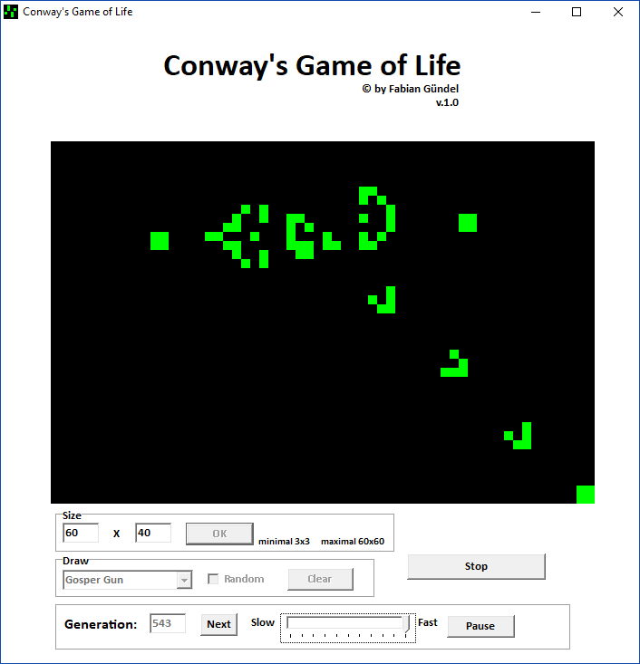

# Game of Life

This was a school project I did in 11th grade. It's not really supposed to be used but, to my surprise, still works on Windows 10.  
If you want to play around with a pretty basic version of Conways Game of Life, grab the `conway.exe` and have fun.

No idea how to compile the code or add features but feel free to try. I just put the code on Github so it doesn't get lost. ✌️



### Original Readme.txt

```
 _________________________________________________
/                                                 \
|              Conway's Game of Life              |
|                              v.1.0              |
|=================================================|
|                                                 |
|       Developer/Programmer: Fabian Gündel       |
|       Programs: Borland Delphi 7 Enterprise     |
|=================================================|
|                                                 |
|  Conway's Game of Life                          |
|  ~~~~~~~~~~~~~~~~~~~~~                          |
|       Conway's Spiel des Lebens wurde 1970 von  |
|       John Horton Conway entworfen.             |
|       Es folgt 4 einfachen Regeln:              |
|               1. Eine tote Zelle mit genau 3    |
|                  lebenden Nachbarn wird in der  |
|                  nächsten Generation neu        |
|                  geboren.                       |
|               2. Lebende Zellen mit weniger als |
|                  2 lebenden Nachbarn sterben in |
|                  der Folgegeneration an         |
|                  Einsamkeit.                    |
|               3. Eine lebende Zelle mit 2 oder  |
|                  3 lebenden Nachbarn bleibt in  |
|                  der Folgegeneration lebend.    |
|               4. Lebende Zellen mit mehr als 3  |
|                  Nachbarn sterben in der Folge- |
|                  generation an Überbevölkerung. |
|       Nach diesem einfachen Prinzip ver-        |
|       ändern sich die Zivilisationen von        |
|       Generation zu Generation.                 |
|=================================================|
|                                                 |
|  Versionsinfo:                                  |
|       v.1.0   -> zufällige oder selbst          |
|                  erstellte Zivilisationen       |
|               -> Variable Feldgröße             |
|               -> Variable Geschwindigkeit       |
|               -> verschiedene Figuren zur       |
|                  Auswahl                        |
|                                                 |
|=================================================|
|                                                 |
|          Viel Spass bei der Nutzung!            |
|                                                 |
\_________________________________________________/

```